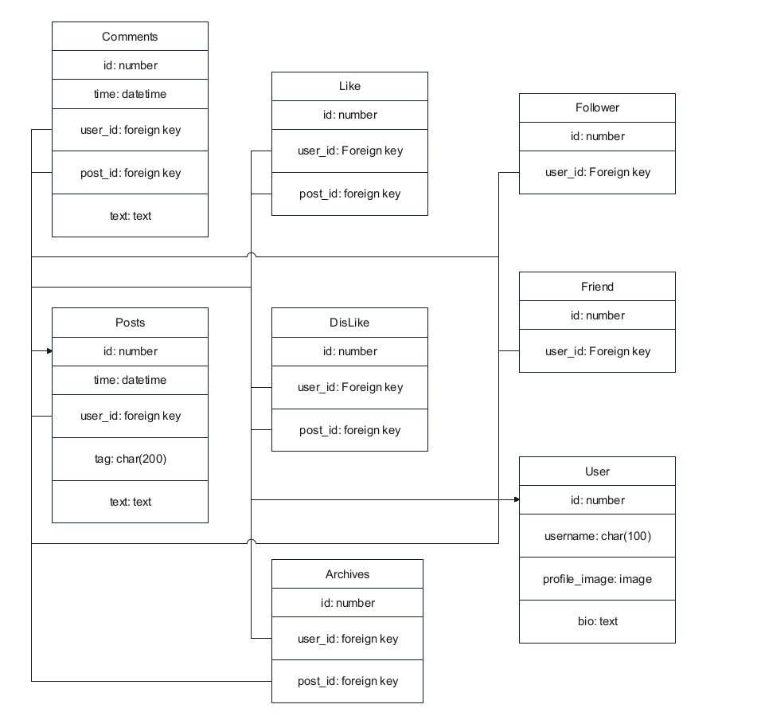

# Twitter Django

Users of this simple and small social media can do the following and take advantage of many features

## Features

1. Have their own user profile with their username, picture and bio.
2. View other people's user profiles and send them friend or follow requests.
3. Publish posts containing relatively long texts and a number of photos with a title and category tags.
4. Users should have the ability to like and dislike the contents and posts, as well as to register comments within each other.
5. In addition to following people, users can also follow all the contents of a particular category sticker.
6. Before logging in, users should only be able to view content or search for people with a username.

## Built With

Python 3
Django
HTML & CSS
SQLite (Database) 

## Authors

Matin Ghane
